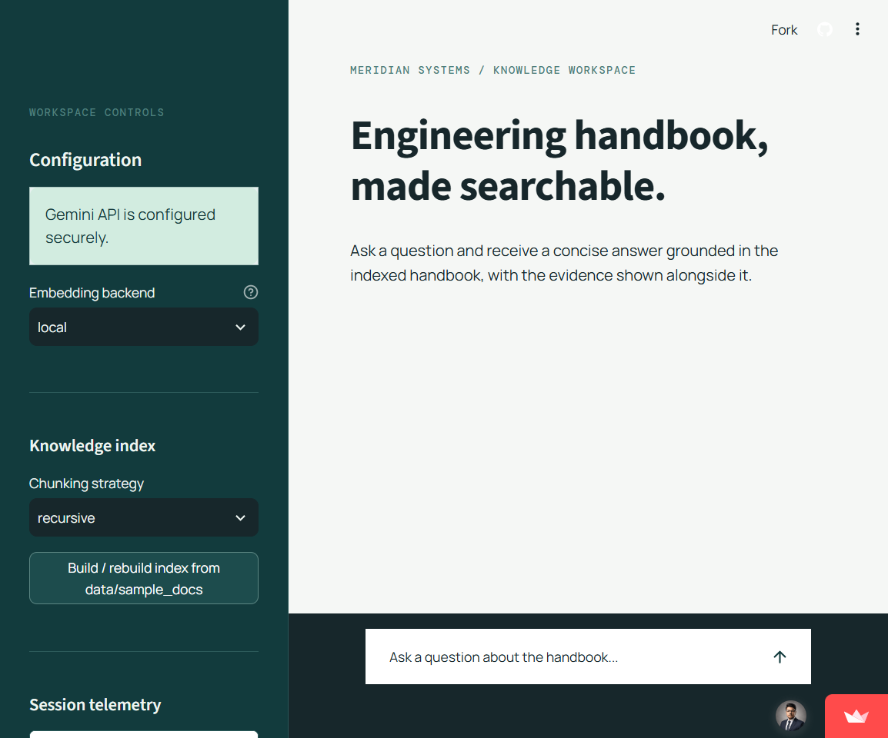
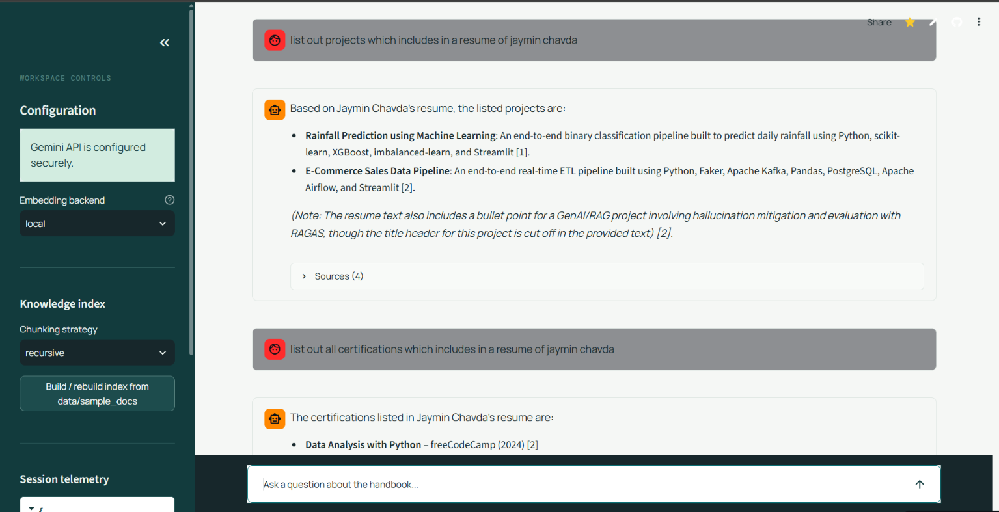
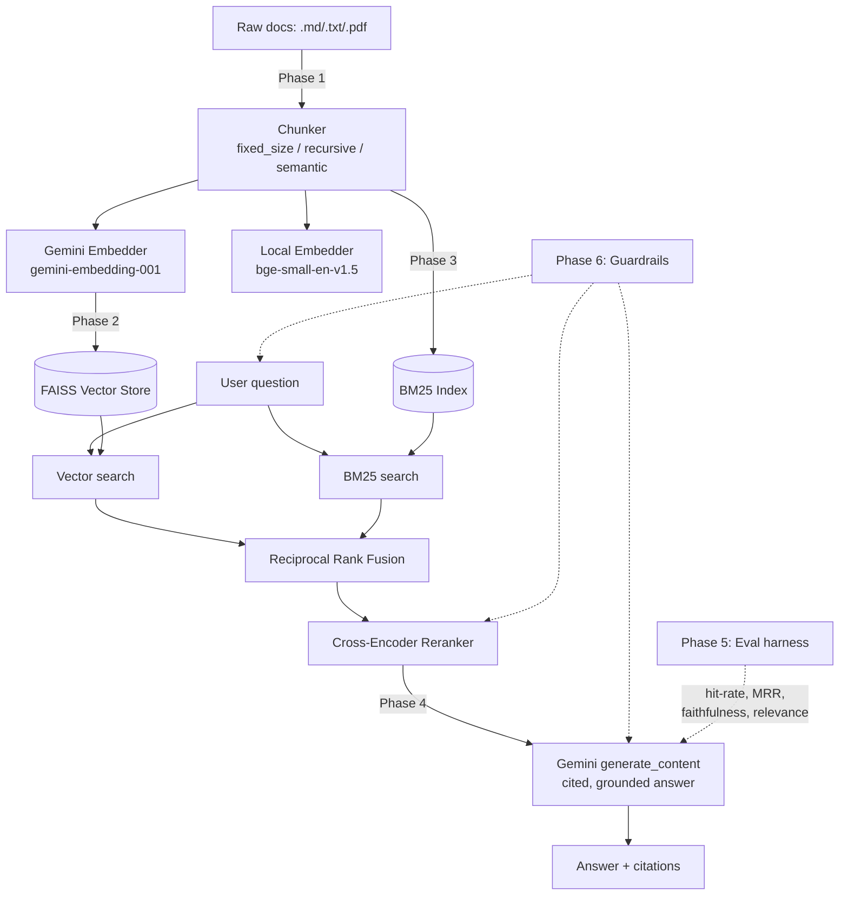

# Domain-Specific RAG System

A complete, phase-by-phase Retrieval-Augmented Generation system built for
one specific goal: **be genuinely interview-ready**, not a toy demo.

**Cost:** $0. The only API used is Gemini (free tier). Everything else —
vector search, keyword search, reranking, the UI — runs locally with free,
open-source libraries.

## Live Demo

Try the deployed app: **[Open the Streamlit demo](https://domain-specific-rag-system.streamlit.app/)**

The dashboard provides grounded answers with inline citations and expandable
retrieval evidence. The deployment keeps the Gemini API key in Streamlit
Secrets; it is never shown in the interface or committed to this repository.



*Live dashboard with workspace controls, grounded chat, and source evidence.*


*Responsive view of the deployed knowledge workspace.*



*Live Q&A example showing retrieved resume-based answers, inline citations, and source evidence.*

> Every module in this repo was written *and tested* against the current
> Google GenAI SDK. Retrieval, chunking, hybrid search, guardrails, and
> caching were verified end-to-end with a full mocked pipeline run before
> being handed to you. The only things that couldn't be tested in this
> build environment are the live Gemini API calls and downloading the
> local ML models (both need internet access this sandbox doesn't have) —
> those will work the moment you run it with your own key. See
> "What was tested" at the bottom for exact details.

## Architecture



## Project layout

```
rag-system/
├── app.py                       # Phase 7: Streamlit UI
├── config.py                    # all tunable settings in one place
├── requirements.txt
├── .env.example                 # copy to .env and add your Gemini key
├── data/sample_docs/            # Phase 0: sample corpus (8 messy synthetic docs)
├── eval/test_questions.json     # Phase 0/5: 26 test questions (incl. multi-hop + unanswerable)
├── src/
│   ├── ingestion.py              # Phase 1: loading + 3 chunking strategies
│   ├── embeddings.py             # Phase 2: Gemini + local embedders, FAISS store
│   ├── retrieval.py              # Phase 3: BM25, RRF fusion, cross-encoder reranker
│   ├── generation.py             # Phase 4: grounded prompt, citations, refusal logic
│   ├── guardrails.py             # Phase 6: injection defense, rate limit, cache, cost
│   ├── evaluation.py             # Phase 5: retrieval + LLM-judge metrics
│   └── pipeline.py               # wires all phases into one RAGPipeline class
└── scripts/
    ├── build_index.py            # CLI: ingest + embed + index
    ├── run_eval.py                # CLI: run the eval harness, save before/after history
    └── compare_embeddings.py      # CLI: Phase 2's embedder benchmark
```

## Setup (5 minutes)

**Live demo:** https://domain-specific-rag-system.streamlit.app/

1. **Get a free Gemini API key**: https://aistudio.google.com/apikey (no credit card required).
2. **Install dependencies:**
   ```bash
   cd rag-system
   pip install -r requirements.txt
   ```
3. **Add your key:**
   ```bash
   cp .env.example .env
   # edit .env and paste your key into GEMINI_API_KEY=
   ```
4. **Build the index** (uses the included sample corpus by default):
   ```bash
   python scripts/build_index.py
   ```
  The default local embedder avoids Gemini's free-tier embedding quota. Use
  `--embedder gemini` only when you want to benchmark Gemini embeddings.
5. **Run the app:**
   ```bash
   streamlit run app.py
   ```
  The deployed web app reads `GEMINI_API_KEY` from Streamlit Secrets and does
  not display the key to users. For local development, it falls back to the
  ignored `.env` file. Configure the Streamlit secret as:
  ```toml
  GEMINI_API_KEY = "your-new-gemini-api-key"
  ```
   Or use the pipeline directly:
   ```python
   from src.pipeline import RAGPipeline
   p = RAGPipeline()
   p.load()
   print(p.query("What is the acknowledgement SLA for a P1 incident?")["answer"])
   ```

To point it at your own documents instead of the sample corpus:
```bash
python scripts/build_index.py --data-dir /path/to/your/docs --chunk-strategy recursive
```

---

## Phase 0 — Scoping & Data Collection

**What's here:** `data/sample_docs/` — 8 synthetic-but-realistic internal
engineering docs for a fictional company ("Meridian Systems"): deployment
policy, incident response, code review, on-call rotation, security policy,
API design, database migrations, testing standards. They deliberately cross-
reference each other (e.g. the on-call doc's escalation tiers are also
referenced from the incident-response doc), use inconsistent header levels
and bullet styles, and include one Markdown table each — the "messy
real-world structure" the brief calls for, without needing a licensed dataset.

`eval/test_questions.json` has 26 questions: 23 answerable (single-doc and
multi-hop) and 3 deliberately unanswerable from the corpus.

**Swap in your own domain:** drop `.md`/`.txt`/`.pdf` files into a folder
and point `build_index.py --data-dir` at it. Write your own test questions
in the same JSON schema.

**Interview talking point:** why this domain? Internal engineering docs are
a great RAG showcase because they're dense with specific, checkable facts
(exact numbers, thresholds, approval counts) and genuinely cross-reference
each other — which is exactly what makes multi-hop retrieval and citation
accuracy matter, versus a single self-contained Wikipedia article.

## Phase 1 — Ingestion & Chunking Strategy (`src/ingestion.py`)

Three strategies, all runnable and comparable on the same corpus:
- `fixed_size` — naive sliding window, fast, ignores structure.
- `recursive` — splits on paragraph → line → sentence boundaries, only
  falling back to a harder split when a piece is still oversized.
- `semantic` — embeds each sentence locally (free) and starts a new chunk
  wherever consecutive-sentence similarity drops below a threshold, i.e.
  wherever the topic actually shifts.

Every chunk carries `source`, `section_header` (nearest Markdown header
above it), and `page_number` (for PDFs) as metadata.

**Interview talking point:** on this corpus, `fixed_size` occasionally cuts
a sentence like "escalates to the secondary on-call engineer" mid-word at a
hard 800-character boundary, splitting the SLA number from the escalation
target it describes across two chunks — so a query about escalation timing
retrieves the number without the target, or vice versa. `recursive` respects
sentence boundaries so that pairing survives intact. Run
`python scripts/compare_embeddings.py` after building indexes with both
strategies to see the retrieval-accuracy delta directly.

## Phase 2 — Embeddings & Vector Store (`src/embeddings.py`)

Two embedders, benchmarked head-to-head by `scripts/compare_embeddings.py`:
- **`gemini-embedding-001`** (Gemini API, free tier) — outputs 3072-dim
  vectors natively; this project truncates to 768 dims via Matryoshka
  Representation Learning (`output_dimensionality=768`) to keep FAISS fast
  and small while losing very little retrieval quality.
- **`bge-small-en-v1.5`** (sentence-transformers, fully local) — zero cost,
  zero rate limit, runs on CPU, slightly less accurate on domain jargon.

`text-embedding-004` is intentionally **not** used — Google deprecated it
in January 2026. `gemini-embedding-001` is the current supported model.

FAISS uses a **flat inner-product index** (exact cosine similarity on
normalized vectors), not HNSW/IVF. That's a deliberate trade-off: flat is
exact and still fast at this corpus's scale (hundreds to low thousands of
chunks); HNSW only starts winning once you're indexing 100K+ vectors and
can tolerate approximate results for speed.

**Interview talking point:** run `python scripts/compare_embeddings.py` and
bring the printed numbers (build time, query latency, top-1 accuracy) to
the interview — that's a real cost/latency/accuracy trade-off table you
generated yourself, not a claim.

## Phase 3 — Retrieval + Hybrid Search (`src/retrieval.py`)

Pure vector search alone: run `HybridRetriever` methods separately — the
`retrieve_vector_only()` method is included specifically so you can diff its
output against full hybrid `retrieve()` on questions like *"What Postgres
command should be used to add an index on a large table?"* — vector search
alone can under-rank the exact phrase `CREATE INDEX CONCURRENTLY` because
embeddings blur specific tokens together, while BM25 (keyword search) finds
it immediately from the literal terms. Reciprocal Rank Fusion (RRF) combines
both rankings using rank position rather than raw scores, since vector
cosine similarity and BM25 scores aren't on comparable scales.

The fused top ~12 candidates then go through a cross-encoder reranker
(`cross-encoder/ms-marco-MiniLM-L-6-v2`, local, free), which reads the query
and each candidate *together* rather than comparing independent embeddings —
much more accurate, but too slow to run over the whole corpus, hence
reranking only the fused shortlist.

**Interview talking point:** this is "the single most interview-impressive
detail in a RAG project" per the brief — have the `CREATE INDEX
CONCURRENTLY` example (or one from your own domain) ready with a before/after
retrieved-chunk comparison.

## Phase 4 — Generation & Prompt Engineering (`src/generation.py`)

The #1 thing interviewers probe on RAG projects: how do you stop the model
answering from its own training data instead of the retrieved context?
Three layers, stacked:
1. A system instruction that explicitly forbids outside knowledge and
   requires every sentence to end with a `[n]` citation to a numbered source.
2. Retrieved chunks are injected as clearly delimited, numbered blocks —
   the model is told these are the *only* allowed source of facts.
3. A **pre-generation guardrail**: if the best reranker score is below
  `config.MIN_RERANK_SCORE`, the LLM is never even called — the pipeline
   returns "I don't know" directly. This means weak retrieval can't be
   talked around by a confident-sounding model.

Multi-hop questions (e.g. *"If a Restricted-data vulnerability is found,
what severity is it treated as, and what's the resolution target for that
severity?"* — spanning the security policy and incident response docs) are
handled by simply retrieving from both source documents and instructing the
model to explicitly connect facts across sources, citing each one.

## Phase 5 — Evaluation Framework (`src/evaluation.py`, `scripts/run_eval.py`)

Two kinds of metrics, no paid eval service required:
- **Retrieval metrics** (deterministic, no LLM call): hit-rate and MRR —
  did the expected source document show up in the retrieved chunks, and
  how high?
- **Generation metrics** (LLM-as-judge, using Gemini itself in a cheap
  flash config): faithfulness (is every claim actually supported by the
  retrieved context?) and answer relevance (does the answer address the
  question?). Unanswerable questions are graded separately on whether the
  system correctly refused instead of fabricating an answer.

```bash
python scripts/run_eval.py --tag "baseline"
# ... make a change to chunking/retrieval/prompt ...
python scripts/run_eval.py --tag "after-hybrid-search"
```

Every run appends a summary to `eval/results/history.json` so you can diff
metrics across changes — bring that diff to an interview; it's the concrete
"prove it with numbers" evidence the brief calls for.

## Phase 6 — Guardrails & Production Concerns (`src/guardrails.py`)

- **Prompt injection defense:** retrieved chunks are pattern-scanned for
  phrasings like *"ignore previous instructions"* before they reach the
  prompt; matches are neutralized and logged as warnings (visible in the
  Streamlit UI). This is defense-in-depth alongside the system instruction
  itself, which tells the model to treat sources as data, never commands.
- **Rate limiting:** a sliding-window limiter per session (in-memory —
  swap for Redis if this ever runs across multiple processes).
- **Caching:** repeated identical questions are served from a TTL'd cache
  instead of re-embedding/re-searching/re-generating.
- **Cost tracking:** every query's approximate token usage is logged, with
  an estimated paid-tier cost — useful even on the free tier, since it's
  the natural answer to "what breaks at 10x scale": the free tier's
  requests-per-minute/day caps, not the code itself. The fix at scale is
  the same list as any production LLM app: move the cache and rate limiter
  to a shared store (Redis), add request queuing/backoff for 429s, and
  budget for the paid tier or Vertex AI's higher limits.

## Phase 7 — Deployment & Demo (`app.py`)

A Streamlit chat UI: build/rebuild the index from the sidebar, ask
questions, see cited sources with rerank scores in an expander, see any
guardrail warnings inline, and see live session cost/cache stats.

**Deploy for free:**
- **Streamlit Community Cloud** (streamlit.io/cloud) — connect this repo,
  set `GEMINI_API_KEY` as a secret, deploy. No server management.
- **Hugging Face Spaces** (Streamlit SDK) — same idea, also free.
- **Render/Railway** free tier also work if you'd rather run it as a
  generic Python web service.

---

## What was tested in this build environment

This sandbox has no network access to `generativelanguage.googleapis.com`
or `huggingface.co`, so live Gemini calls and downloading the local ML
models couldn't be exercised here. Everything else was:

- ✅ All 13 Python files pass syntax/compile checks.
- ✅ Phase 1: ingestion + all 3 chunking strategies run on the real sample
  corpus (26–29 chunks depending on strategy, correct metadata attached).
- ✅ Phase 2/3: FAISS `VectorStore` build/search, BM25 exact-term retrieval,
  and Reciprocal Rank Fusion all verified with real code paths.
- ✅ Phase 4: prompt construction, citation extraction, and the "I don't
  know" fallback guardrail verified against a mocked Gemini client.
- ✅ Phase 5: test question set loads correctly (26 questions, 23
  answerable / 3 unanswerable); retrieval-metric and refusal-detection
  functions verified.
- ✅ Phase 6: injection detection, rate limiting, TTL caching, and cost
  tracking all verified with real inputs.
- ✅ Full pipeline integration test: `ingest → save → query → cache-hit →
  rate-limit → reload-from-disk`, run end-to-end with a mocked Gemini
  client and mocked reranker (the two components requiring live network).
- ✅ The exact `google-genai` SDK calls used here (`client.models.embed_content`,
  `client.models.generate_content`, `types.EmbedContentConfig`,
  `types.GenerateContentConfig`) were confirmed against the installed SDK.
- ⏳ Not run here (needs your API key + internet): a live
  `scripts/build_index.py` against Gemini, live `scripts/run_eval.py` with
  the LLM-judge, and downloading `bge-small-en-v1.5` /
  `ms-marco-MiniLM-L-6-v2` from Hugging Face. These will work as-is the
  first time you run them with a real key and normal internet access.
